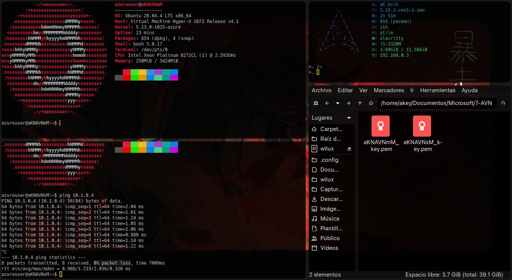
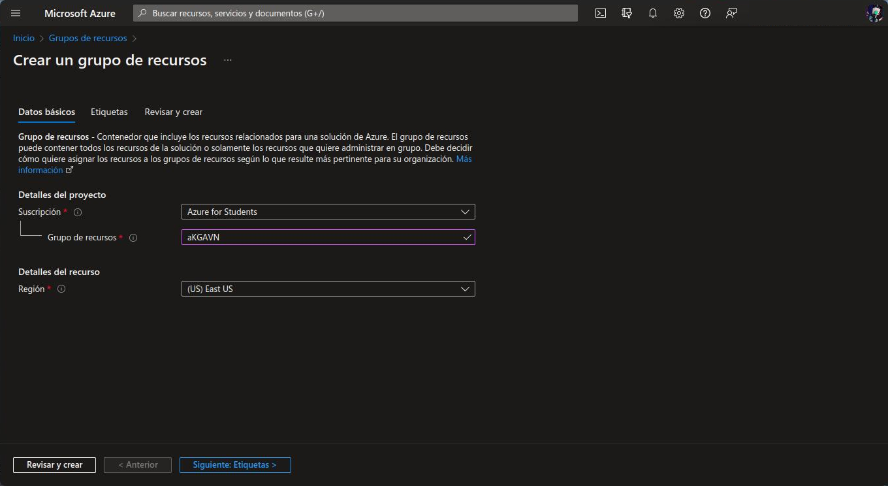
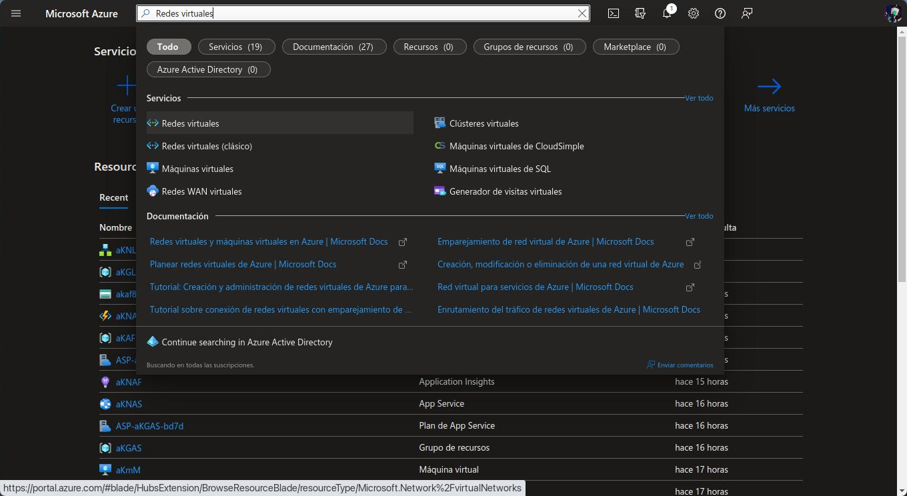
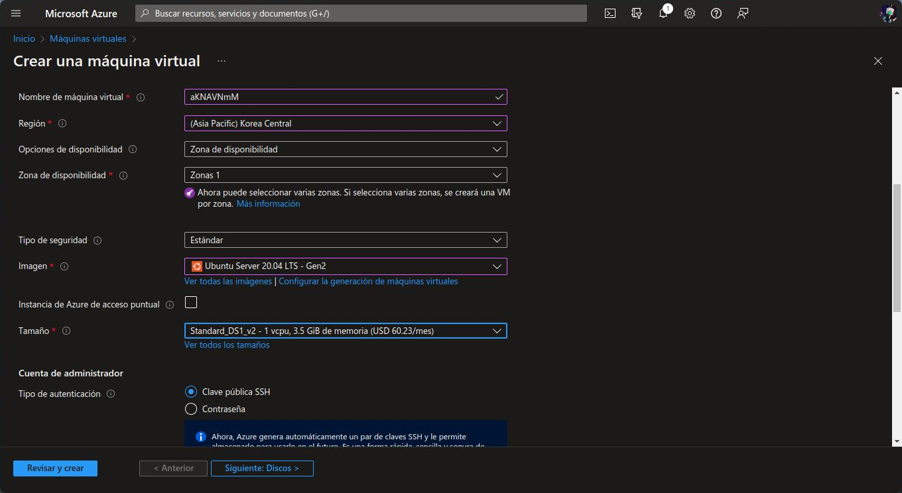
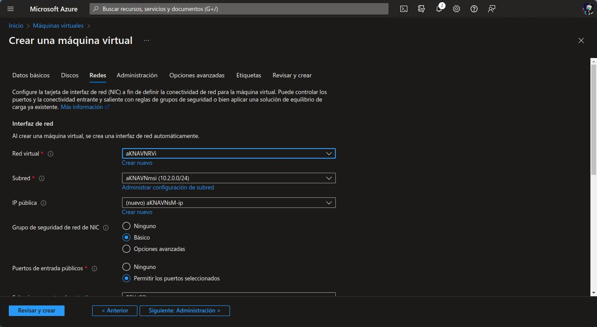
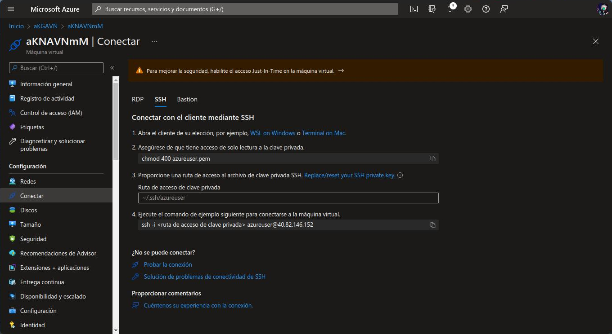
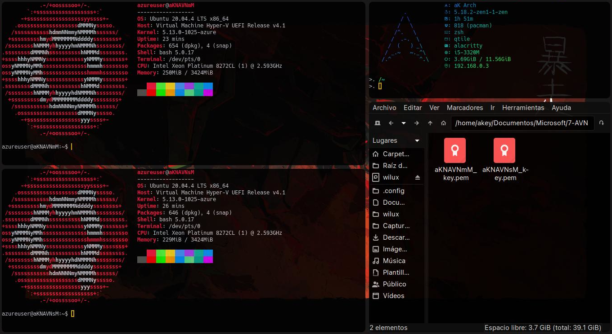
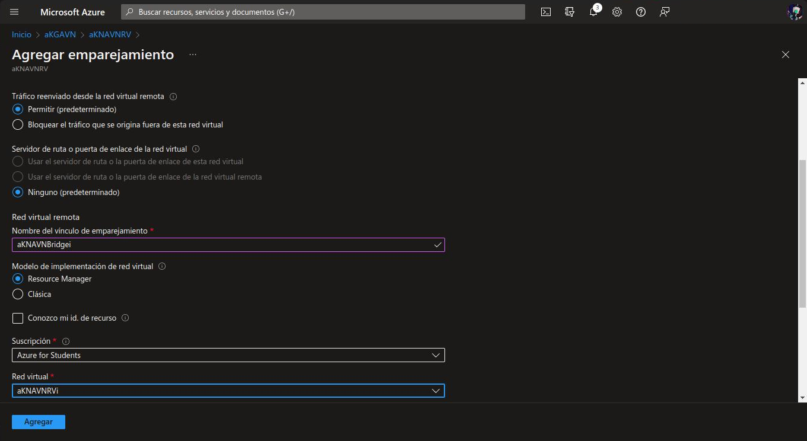
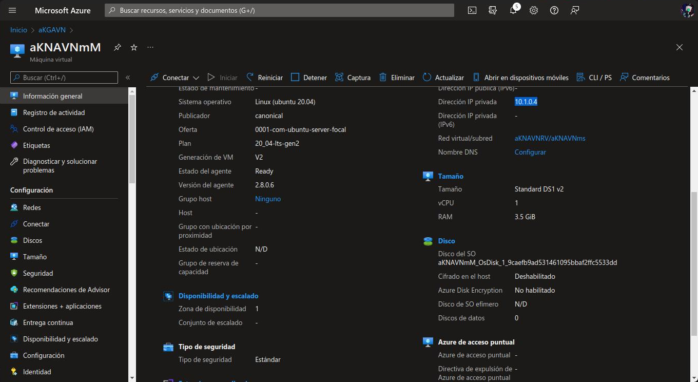

# Emparejar máquinas de diferentes redes virtuales

Recordotario: Es necesario contar con una cuenta de Azure y una suscripción a Azure.

Para este trabajo se usan 3 recursos desde el [portal de Azure](https://portal.azure.com). 

# Grupos de recursos
Creamos un grupo de recursos llenando el formulario de **Datos básicos** con la suscripción a Azure, nombre y la región.



# Redes virtuales
Creamos dos redes virtuales el formulario de **Datos básicos** con el nombre de la red virtual, la suscription y la región. Es importante que considerar la región ya que no en todas se pueden hacer las mismas máquinas virtuales. En el formulario **Direcciones IP** revisamos que exista un espacio de direccones IPv4 y modificamos la subred o creamos una nueva con el ```Intervalo de direcciones de subred: 10.X.0.0/24```.


# Máquinas virtuales
Creamos dos **máquinas virtuales de Azure** el formulario de **Datos básicos** con el nombre de la máquina virtual, la suscription, la región. En este caso usaremos una imagen de **Ubuntu Server**, por lo que usaremos una clave SSH para la conexión. Cuando creemos la máquina virtual, se creará una clave SSH (```.pem```) para la conexión la cual necesitaremos para acceder a la máquina virtual.


En el formulario **Redes** utilizamos la red virtual y subred creadas anteriormente para cada máquina virtual.


## Uso de las máquinas virtuales
Para usar cada máquina virtual, debemos conectarnos a ella con una clave SSH. Desde Linux necesitamos ejecutar los siguientes comandos:

- Crear una carpeta para la máquina virtual
        
        mkdir ~/.ssh/azureuser 

- Dar acceso al archivo de clave SSH para lectura

        chmod 400 archivo_de_clave_ssh.pem

- Acceder a la carpeta de la máquina virtual

        cd ~/.ssh/azureuser

- Acceder a la carpeta de la máquina virtual desde SSH

        ssh -i archivo_de_clave_ssh.pem azureuser@<direccción_IP_de_la_máquina_virtual>



Si realizamos todos los pasos anteriores, podemos acceder a la máquina virtual. Ya el ejecutar neofetch (```sudo apt update ; sudo apt install neofetch ; clear ; neofetch```) podemos ver la información de la máquina virtual.


## Emparejar máquinas de diferentes redes virtuales
Para emparejar máquinas de diferentes redes virtuales, accedemos a la red virtual de una de las máquinas virtuales en el grupo de recursos y seleccionamos la opción ```Emparejamientos```. Dentro de esta sección podemos agregamos un emparejamiento, en el **Nombre del vínculo de emparejamiento** escribimos el nombre de la máquina virtual que queremos emparejar.


Cuando agregamos el emparejamiento, podemos seleccionar la máquina virtual y hacer un ping a la otra máquina virtual usando su dirección IP privada.


